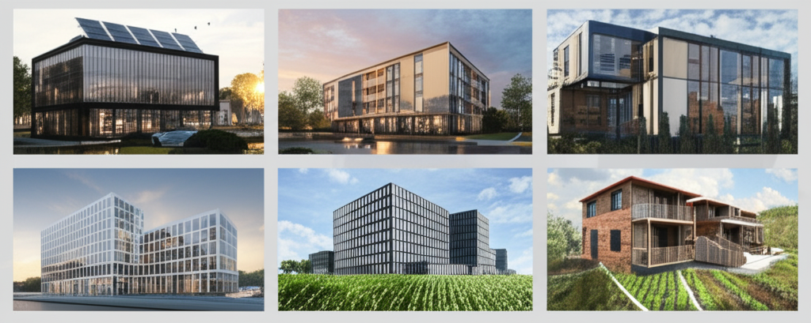

# 🏠 PrimeNest - Real Estate Management System

A modern, comprehensive real estate management platform built with Next.js 14, TypeScript, and Tailwind CSS. PrimeNest provides a complete solution for managing properties, clients, transactions, and analytics in the real estate industry.



## ✨ Features

### 🏢 Property Management
- **Property Listings**: Create, view, edit, and manage property listings
- **Property Details**: Comprehensive property information with images and specifications
- **Property Comparison**: Side-by-side comparison of multiple properties
- **Interactive Map View**: Visualize properties on an interactive map
- **Property Analytics**: Track property performance and metrics

### 👥 Client Management
- **Client Profiles**: Manage client information and preferences
- **Client Dashboard**: Centralized view of client activities
- **Contact Management**: Track client communications and interactions

### 💰 Transaction Management
- **Transaction Tracking**: Monitor all property transactions
- **Financial Analytics**: Revenue tracking and financial insights
- **Transaction History**: Complete audit trail of all transactions

### 📊 Analytics & Reporting
- **Dashboard Overview**: Real-time metrics and KPIs
- **Interactive Charts**: Visual representation of data using Recharts
- **Performance Metrics**: Track key business indicators

### 🎨 User Experience
- **Dark/Light Mode**: Toggle between themes for optimal viewing
- **Responsive Design**: Optimized for desktop, tablet, and mobile devices
- **Modern UI**: Built with shadcn/ui components for a polished interface
- **Smooth Animations**: Enhanced user experience with Framer Motion

## 🚀 Technology Stack

### Frontend
- **[Next.js 14](https://nextjs.org/)** - React framework with App Router
- **[TypeScript](https://www.typescriptlang.org/)** - Type-safe JavaScript
- **[Tailwind CSS](https://tailwindcss.com/)** - Utility-first CSS framework
- **[shadcn/ui](https://ui.shadcn.com/)** - Re-usable components built on Radix UI
- **[Framer Motion](https://www.framer.com/motion/)** - Animation library

### UI Components & Libraries
- **[Radix UI](https://www.radix-ui.com/)** - Unstyled, accessible UI primitives
- **[Lucide React](https://lucide.dev/)** - Beautiful & consistent icon library
- **[Recharts](https://recharts.org/)** - Composable charting library
- **[React Hook Form](https://react-hook-form.com/)** - Performant forms with validation
- **[Zod](https://zod.dev/)** - TypeScript-first schema validation

### Development Tools
- **[PNPM](https://pnpm.io/)** - Fast, disk space efficient package manager
- **[PostCSS](https://postcss.org/)** - CSS transformation tool
- **[ESLint](https://eslint.org/)** - Code linting and formatting

## 📁 Project Structure

```
real-estate-management/
├── app/                        # Next.js App Router
│   ├── globals.css            # Global styles
│   ├── layout.tsx             # Root layout component
│   ├── page.tsx               # Home page
│   ├── api/                   # API routes
│   │   ├── clients/           # Client management API
│   │   ├── properties/        # Property management API
│   │   └── transactions/      # Transaction management API
│   ├── comparison/            # Property comparison page
│   └── properties/            # Property details pages
├── components/                # React components
│   ├── ui/                    # shadcn/ui components
│   ├── dashboard.tsx          # Main dashboard component
│   ├── property-list.tsx      # Property listing component
│   ├── client-list.tsx        # Client management component
│   ├── transaction-list.tsx   # Transaction tracking component
│   ├── map-view.tsx           # Interactive map component
│   └── ...
├── context/                   # React context providers
├── hooks/                     # Custom React hooks
├── lib/                       # Utility functions
├── public/                    # Static assets
├── styles/                    # Additional stylesheets
└── config files              # Configuration files
```

## 🛠️ Installation

### Prerequisites
- **Node.js** (version 18 or higher)
- **PNPM** (recommended) or npm/yarn
- **Git**

### Setup Steps

1. **Clone the repository**
   ```bash
   git clone https://github.com/RensithUdara/PrimeNest-real-estate-management.git
   cd PrimeNest-real-estate-management
   ```

2. **Install dependencies**
   ```bash
   pnpm install
   ```
   
   Or with npm:
   ```bash
   npm install
   ```

3. **Run the development server**
   ```bash
   pnpm dev
   ```
   
   Or with npm:
   ```bash
   npm run dev
   ```

4. **Open your browser**
   Navigate to [http://localhost:3000](http://localhost:3000) to see the application.

## 🏃‍♂️ Available Scripts

- `pnpm dev` - Start development server
- `pnpm build` - Build for production
- `pnpm start` - Start production server
- `pnpm lint` - Run ESLint

## 🎯 Key Features Walkthrough

### Dashboard Overview
The main dashboard provides a comprehensive view of your real estate business with:
- Key performance indicators (KPIs)
- Recent activities
- Quick access to all major features
- Real-time data visualization

### Property Management
- **Add Properties**: Easy-to-use forms for adding new properties
- **Property Grid/List View**: Toggle between different viewing modes
- **Advanced Filtering**: Filter by price, location, type, and more
- **Property Details**: Detailed view with image galleries and specifications

### Client Management
- **Client Profiles**: Maintain detailed client information
- **Activity Tracking**: Monitor client interactions and preferences
- **Communication History**: Track all client communications

### Transaction Tracking
- **Transaction Dashboard**: Overview of all transactions
- **Status Tracking**: Monitor transaction progress
- **Financial Reports**: Generate financial insights and reports

## 🎨 Customization

### Theming
The application supports both dark and light themes. You can customize the theme by modifying the Tailwind CSS configuration in `tailwind.config.ts`.

### Components
All UI components are built using shadcn/ui and can be easily customized. Components are located in the `components/ui/` directory.

### Styling
The project uses Tailwind CSS for styling. Global styles are defined in `app/globals.css`.

## 🚀 Deployment

### Vercel (Recommended)
1. Push your code to a Git repository
2. Import your project on [Vercel](https://vercel.com)
3. Deploy with zero configuration

### Other Platforms
The application can be deployed on any platform that supports Next.js:
- **Netlify**
- **AWS Amplify**
- **Railway**
- **DigitalOcean App Platform**

### Build for Production
```bash
pnpm build
pnpm start
```

## 📱 Mobile Responsiveness

PrimeNest is fully responsive and optimized for:
- **Desktop** (1200px and above)
- **Tablet** (768px - 1199px)
- **Mobile** (320px - 767px)

## 🧪 Testing

The project is set up for testing with:
- Component testing capabilities
- TypeScript type checking
- ESLint code quality checks

## 🤝 Contributing

1. Fork the repository
2. Create a feature branch (`git checkout -b feature/amazing-feature`)
3. Commit your changes (`git commit -m 'Add some amazing feature'`)
4. Push to the branch (`git push origin feature/amazing-feature`)
5. Open a Pull Request

## 📄 License

This project is licensed under the MIT License - see the [LICENSE](LICENSE) file for details.

## 👨‍💻 Author

**Rensith Udara**
- GitHub: [@RensithUdara](https://github.com/RensithUdara)

## 🙏 Acknowledgments

- [shadcn/ui](https://ui.shadcn.com/) for the beautiful component library
- [Radix UI](https://www.radix-ui.com/) for accessible UI primitives
- [Tailwind CSS](https://tailwindcss.com/) for the utility-first CSS framework
- [Next.js](https://nextjs.org/) for the amazing React framework

## 📞 Support

If you have any questions or need help, please:
1. Check the [documentation](https://nextjs.org/docs)
2. Open an [issue](https://github.com/RensithUdara/PrimeNest-real-estate-management/issues)
3. Contact the maintainer

---

<div align="center">
  <p>Made with ❤️ for the real estate industry</p>
  <p>⭐ Star this repository if you find it helpful!</p>
</div>
